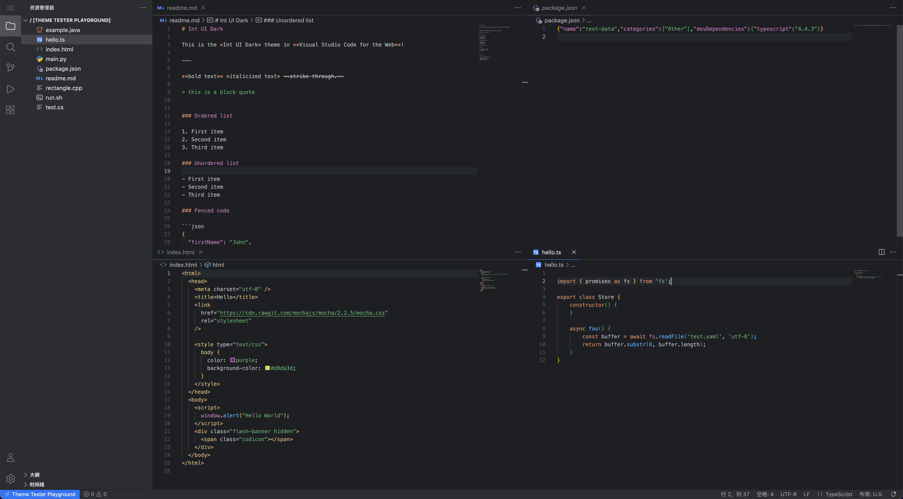

# Int UI Theme

> 🎨 Experience JetBrains' modern UI design in Visual Studio Code

[
](https://marketplace.visualstudio.com/items?itemName=baran-wang.vscode-theme-jetbrains-new-ui)
[
](https://open-vsx.org/extension/baran-wang/vscode-theme-jetbrains-new-ui)





## 🚀 Quick Start

### Installation

#### Method 1: VSCode Extension Marketplace
1. Open VSCode
2. Press `Ctrl+Shift+X` (Windows/Linux) or `Cmd+Shift+X` (macOS) to open the Extensions panel
3. Search for "Int UI Theme"
4. Click Install

#### Method 2: Command Line Installation
```bash
code --install-extension baran-wang.vscode-theme-jetbrains-new-ui
```

### Activate Theme

1. Press `Ctrl+Shift+P` (Windows/Linux) or `Cmd+Shift+P` (macOS) to open the Command Palette
2. Type "Preferences: Color Theme"
3. Select one of the following themes:
   - `Int UI Dark` - Dark theme

### Activate Icon Theme

1. Press `Ctrl+Shift+P` (Windows/Linux) or `Cmd+Shift+P` (macOS) to open the Command Palette
2. Type "Preferences: File Icon Theme"
3. Select one of the following icon themes:
   - `Int UI Icons Dark` - Dark icon theme
   - `Int UI Icons Light` - Light icon theme

### Activate Product Icon Theme

1. Press `Ctrl+Shift+P` (Windows/Linux) or `Cmd+Shift+P` (macOS) to open the Command Palette
2. Type "Preferences: Product Icon Theme"
3. Select `Int UI Product Icons`

## 🎨 Theme Preview

### Online Preview
[Preview on VSCode Themes](https://vscodethemes.com/e/baran-wang.vscode-theme-jetbrains-new-ui/int-ui-dark/open?with=vscodeweb)

### Local Preview
After installation, you can preview all theme effects in real-time in VSCode.

## 📦 What's Included

### 🎨 Color Themes
- **Int UI Dark** - Dark theme based on JetBrains' new UI

### 🔤 Icon Themes
- **Int UI Icons Dark** - Dark style icon theme
- **Int UI Icons Light** - Light style icon theme

### 🚀 Product Icon Theme
- **Int UI Product Icons** - Modern product icon collection

## ⚙️ Configuration Options

You can customize theme configuration in VSCode's `settings.json`:

```json
{
  "workbench.colorTheme": "Int UI Dark",
  "workbench.iconTheme": "Int UI Icons Dark",
  "workbench.productIconTheme": "Int UI Product Icons"
}
```

## 📄 License

This project is open source under the [MIT License](LICENSE).

## 🙏 Acknowledgments

- Thanks to the JetBrains team for providing excellent design inspiration
- Thanks to all developers who have contributed to this project
- Thanks to the VSCode community for their support
